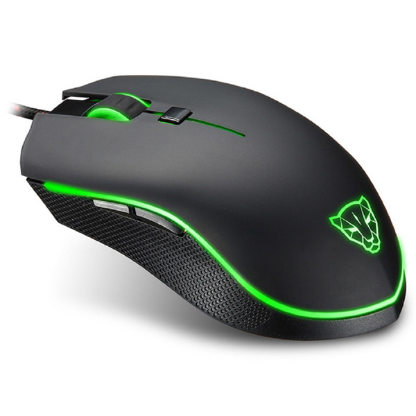

# motospeedv40-re
Motospeed V40 Mouse Reverse Engineering



See more, [here](res/README.md).

## Specifications

- **Manufacturer:** Mototech Technology Group Ltd
- **Optical Sensor:** Avago ADNS-3050 ([Datasheet](https://media.digikey.com/pdf/data%20sheets/avago%20pdfs/adns-3050.pdf))
- **MCU:** Holtek HT82F553 8-bit (No Datasheet)
- **Firmware:** [Here](http://www.motospeed.cc/upfile/20190925155719_430.zip)
- **Driver:** [Here](http://www.motospeed.cc/upfile/download/MotoSpeed%20Gaming%20MouseV40.zip)

## Protocol

To achieve this protocol description, I got some packets from the Windows
driver using Wireshark. See [here](packets/README.md).

### Commands

HID Feature report packets size: 8 bytes
HID Output report packets size: 32 bytes

#### Command `0x28`: Init

- Activate DPI triggers: `{0xb2, 0x0d, 0x08, 0x78, 0x32, 0xe6, 0xee}`

#### Command `0x26`: General

- Change LED colors: `{0x95, 0xf5, 0x08, 0x80, 0x95, 0xa6, 0x36}`

    Structure: Next output report packet, 24-bit color for each profile, with 4
    total profiles.

- Change DPI: `{0x94, 0x95, 0x08, 0x58, 0x9d, 0xa6, 0xb6}`

    Structure: Next output report packet, 1 byte for each profile, with 4 total
    profiles.

- Change Report Rate: `{0x94, 0xf5, 0x08, 0xb8, 0x1d, 0xa6, 0x76}`

### Mouse triggers

- Change of DPI's

    - Endpoint: `0x02`
    - Magic bytes: `{0x06, 0x07, 0x01}`

    The fourth byte is for the current DPI mode.

    Example Packet:
    ```
    06 07 01 04
    06 00 00 00
    ```

## DPI Levels

|Byte|DPI Value|
|----|---------|
|01  |      250|
|02  |      500|
|03  |      750|
|04  |     1000|
|05  |     1250|
|06  |     1500|
|07  |     1750|
|08  |     2000|
|25  |     2500|
|26  |     3000|
|27  |     3500|
|28  |     4000|

**NOTE:** To disable the DPI profile, do a bitwise OR with the value and `0x80`, which in practice is the most significant bit. (e.g.:
enabled profile 1 is `0x01` and disabled profile 1 is `0x81`).